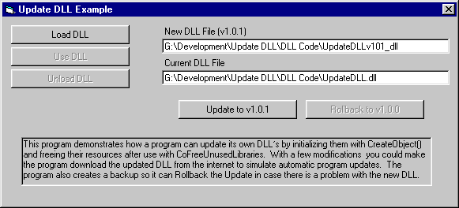



## Program that updates its own DLL

### Description

This program demonstrates how a program can update its own DLL&#8217;s by initializing them with CreateObject() and freeing their resources after use with CoFreeUnusedLibraries. With a few modifications you could make the program download the updated DLL from the internet to simulate automatic program updates. The program also creates a backup so it can Rollback the Update in case there is a problem with the new DLL.
 
### More Info
 

             |
---                |---
**Submitted On**   |2001-07-25 13:44:10
**By**             |[Nickels](https://github.com/Planet-Source-Code/PSCIndex/blob/master/ByAuthor/nickels.md)
**Level**          |Intermediate
**User Rating**    |4.5 (45 globes from 10 users)
**Compatibility**  |VB 4\.0 \(16\-bit\), VB 4\.0 \(32\-bit\), VB 5\.0, VB 6\.0
**Category**       |[Libraries](https://github.com/Planet-Source-Code/PSCIndex/blob/master/ByCategory/libraries__1-49.md)
**World**          |[Visual Basic](https://github.com/Planet-Source-Code/PSCIndex/blob/master/ByWorld/visual-basic.md)
**Archive File**   |[Program th234947252001\.zip](https://github.com/Planet-Source-Code/nickels-program-that-updates-its-own-dll__1-25490/archive/master.zip)

